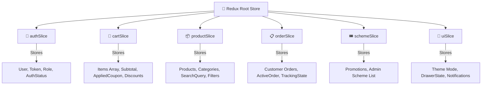

# 📘 Likesszone Frontend (`likesszonefront`) — Complete Technical Specification

[]()
[]()
[]()

> **Comprehensive Technical Blueprint & Component Guide** for the Likesszone Web Application.

---

## 📌 Technical Stack & Version Matrix

| Layer | Library / Tool | Version | Responsibility |
| :--- | :--- | :--- | :--- |
| **UI Framework** | **React** | `^19.2.7` | Component rendering engine & hooks |
| **DOM Renderer** | **React DOM** | `^19.2.7` | Web DOM integration |
| **Build System** | **Vite** | `^8.1.1` | Ultra-fast ESM bundler & HMR dev server |
| **State Engine** | **Redux Toolkit** | `^2.12.0` | Global state management, slice reducers & async thunks |
| **React Redux** | **React-Redux** | `^9.3.0` | Redux store binding hooks (`useDispatch`, `useSelector`) |
| **Routing** | **React Router DOM**| `^7.18.1` | Single-page app client routing & layout protection |
| **Styling System**| **Tailwind CSS** | `^4.3.3` | Utility-first CSS engine via `@tailwindcss/vite` |
| **Icons Suite** | **Lucide React** | `^1.26.0` | Modern SVG iconography |
| **Code Linter** | **Oxlint** | `^1.71.0` | Ultra-fast Rust-powered JavaScript linter |

---

## 🧩 Redux Toolkit State Management Architecture

Centralized application state is organized in `src/store/slices/`.



### Slice Details

1. **`authSlice.js`**:
   - Handles `loginUser`, `registerUser`, `fetchCurrentUser`, `updateUserProfile`, and `logout`.
   - Automatically reads stored JWT token from `localStorage` upon initial app boot.
2. **`cartSlice.js`**:
   - Manages cart line items, quantity adjustment thunks, total price calculation, coupon code application, and clearing items.
   - Synchronizes cart operations directly with backend API endpoint `/api/cart`.
3. **`productSlice.js`**:
   - Centralizes products list, category filter selection, sorting options, search strings, and admin product CRUD actions.
4. **`orderSlice.js`**:
   - Manages order placement (`createOrder`), order retrieval for customer history (`fetchMyOrders`), and admin status updates (`updateOrderStatus`).
5. **`schemeSlice.js`**:
   - Manages active promotional schemes, coupon validations, and administrative scheme creation.
6. **`uiSlice.js`**:
   - Stores dark mode toggle preference (`dark` | `light`), active cart drawer visibility state, and global toast notification messages.

---

## 🗺️ Router Map & Protected Layouts

App routes are registered in `src/App.jsx` using `React Router DOM v7`.

```mermaid
flowchart TD
    AppRouter[App.jsx Router] --> StoreLayout[StoreLayout Component]
    AppRouter --> AdminLayout[AdminLayout Component]
    AppRouter --> AuthPages[Auth Pages]

    StoreLayout --> Home[Home /]
    StoreLayout --> Shop[ProductList /shop]
    StoreLayout --> Detail[ProductDetail /product/:id]
    StoreLayout --> CartPage[Cart /cart]
    StoreLayout --> CheckoutPage[Checkout /checkout]
    StoreLayout --> OrdersPage[MyOrders /my-orders]
    StoreLayout --> SettingsPage[Settings /settings]

    AdminLayout -->|Protected by AdminRoute Guard| AdminDash[DashboardOverview /admin]
    AdminLayout --> ProductMgr[ProductManager /admin/products]
    AdminLayout --> AddProd[AddProduct /admin/products/add]
    AdminLayout --> EditProd[EditProduct /admin/products/edit/:id]
    AdminLayout --> OrderMgr[OrderManager /admin/orders]
    AdminLayout --> SchemeMgr[SchemeManager /admin/schemes]

    AuthPages --> LoginPage[Login /login]
    AuthPages --> RegisterPage[Register /register]
```



---

## 📡 API Services Integration Layer

All backend communication with `likesszoneback` is organized in `src/services/`:

| Service File | API Base Route | Operations Handled |
| :--- | :--- | :--- |
| **`api.js`** | `/api` | Base Axios client with automatic Bearer token injection |
| **`authService.js`** | `/api/auth` | `login`, `signup`, `getMe`, `updateProfile` |
| **`productService.js`**| `/api/products` | `getProducts`, `getProductById`, `createProduct`, `updateProduct`, `deleteProduct` |
| **`categoryService.js`**| `/api/categories` | `getCategories`, `getCategoryBySlug`, `createCategory`, `updateCategory`, `deleteCategory` |
| **`cartService.js`** | `/api/cart` | `getCart`, `addToCart`, `updateCartItem`, `removeCartItem`, `clearCart` |
| **`orderService.js`** | `/api/orders` | `createOrder`, `getAllOrders`, `getOrderById`, `updateOrderStatus` |
| **`schemeService.js`** | `/api/schemes` | `getSchemes`, `applyScheme`, `createScheme`, `updateScheme`, `deleteScheme` |

---

## 🎨 Design System & Theme Engine

- **Tailwind CSS v4 Engine**: Built using `@tailwindcss/vite` plugin.
- **Color Palette**: Custom crimson, slate gray, and dark obsidian background tones.
- **Dark Mode Support**: Dynamic theme toggling by applying `dark` class to `<html>` root, persisted in `localStorage`.
- **Responsive Layout**: Mobile-first responsive grids (`grid-cols-1 md:grid-cols-3 lg:grid-cols-4`).

---

## 📂 Detailed File Index

```text
likesszonefront/src/
├── App.jsx                     # Application router & provider setup
├── main.jsx                    # React mount point
├── index.css                   # Global styles & Tailwind CSS imports
├── components/
│   ├── layout/
│   │   ├── StoreLayout.jsx     # Store header, category nav, footer & cart drawer wrapper
│   │   └── AdminLayout.jsx     # Admin sidebar navigation, admin header & user session badge
│   ├── guard/
│   │   └── AdminRoute.jsx      # Route guard verifying admin role authorization
│   ├── shop/
│   │   ├── ProductCard.jsx     # Catalog item card with image, price & add-to-cart trigger
│   │   ├── CartDrawer.jsx      # Side-sliding cart drawer component
│   │   ├── ProductFilter.jsx   # Search, price slider, and category filter sidebar
│   │   └── CheckoutForm.jsx    # Shipping & payment details form
│   └── admin/
│       ├── StatsGrid.jsx       # Analytics stats cards grid
│       └── OrderTable.jsx      # Admin order fulfillment table
├── pages/
│   ├── shop/                   # Home, ProductList, ProductDetail, Cart, Checkout, MyOrders, Settings
│   ├── admin/                  # DashboardOverview, ProductManager, AddProduct, EditProduct, OrderManager, SchemeManager
│   └── auth/                   # Login, Register
├── services/                   # Axios API service callers
└── store/
    ├── index.js                # Store reducer configuration
    ├── hooks.js                # Typed useDispatch & useSelector hooks
    └── slices/                 # Redux Slices (auth, cart, product, order, scheme, ui)
```

---

## ⚡ Execution & Commands Guide

```bash
# Install NPM packages
npm install

# Run local development server (with HMR)
npm run dev

# Run Oxlint JavaScript linter
npm run lint

# Build production bundle
npm run build

# Preview production build locally
npm run preview
```

---

*Likesszone Frontend UI Technical Documentation Specification*
