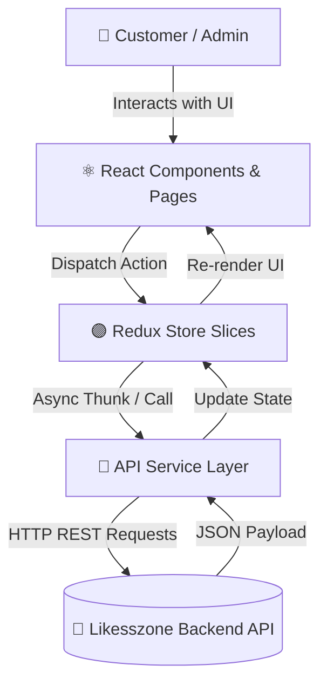
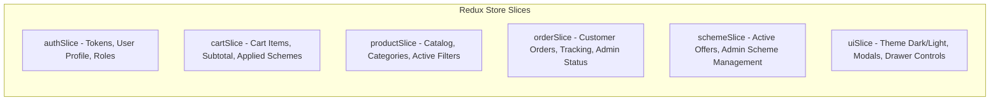

# 🎨 Likesszone Frontend (`likesszonefront`)

[](https://react.dev/)
[](https://vitejs.dev/)
[](https://redux-toolkit.js.org/)
[](https://tailwindcss.com/)
[](https://reactrouter.com/)

> **Modern, Ultra-Responsive E-Commerce Storefront & Admin Control Center** built with React 19, Redux Toolkit, Tailwind CSS v4, and Vite. Designed to connect seamlessly with the `likesszoneback` Express REST API.

---

## 📖 Quick Links
- 🚀 [Quick Demo Credentials](#-quick-demo-credentials)
- 🏗️ [Architecture & Redux Store](#-architecture--redux-store)
- 🛍️ [Storefront & Admin Features](#-storefront--admin-features)
- 📂 [Directory & Component Map](#-directory--component-map)
- 📡 [Backend Integration & API Services](#-backend-integration--api-services)
- ⚡ [Getting Started & Build Commands](#-getting-started--build-commands)

---

## 🚀 Quick Demo Credentials

For testing store browsing, cart checkout, and the administrative dashboard:

| Role | Email | Password | Access Rights |
| :--- | :--- | :--- | :--- |
| **🛡️ Administrator** | `admin@likesszon.com` | `admin123` | Full access to Admin Panel, Revenue Stats, Product Catalog Management, Order Tracking, Scheme Management. |
| **👤 Customer** | `user@likesszon.com` | `user123` | Customer Storefront, Cart, Checkout, Order History, Settings & Profile management. |
| **👀 Guest User** | *None* | *None* | Browse catalog, search products, add items to cart (prompted to log in at checkout). |

---

## 🏗️ Architecture & Redux Store

The application uses **Redux Toolkit** for predictable, centralized global state management, combined with **Axios-based API services** to sync data with the backend.



### Redux State Slices Breakdown



> [!NOTE]
> The Redux state automatically syncs JWT tokens and active cart sessions with `localStorage`, ensuring seamless page refresh persistence.

---

## 🛍️ Storefront & Admin Features

### 🛒 Client Storefront
- **Dynamic Catalog Navigation**: Multi-attribute filtering (Category, Price Range, Search Query, Ratings), with instant sorting (Price Low/High, Popularity, Featured).
- **Rich Product Detail Pages**: Image previews, detailed specifications, stock status badges, customer reviews summary, and direct "Add to Cart" triggers.
- **Interactive Cart & Side Drawer**: Sliding cart drawer with instant quantity increment/decrement, item removal, coupon application, and total price calculation.
- **Streamlined Checkout**: Step-by-step checkout wizard with shipping address forms, payment option selection, scheme application, and order creation.
- **Real-Time Order Tracking**: Customer order history timeline (`Pending` ➡️ `Processing` ➡️ `Delivered`).
- **User Profile & Settings**: Account profile avatar update, name/email edit, dark mode toggle.

### 🛡️ Admin Management Panel
- **Analytics Dashboard**: High-level KPI cards (Total Sales, Total Revenue, Total Products, Total Categories) with recent transactions list.
- **Product Catalog CRUD**: Complete manager to create, edit, or delete store products with custom feature tags, image URLs, prices, and stock inventory.
- **Category Manager**: Add, edit, or remove product categories with image banners.
- **Order Processing Manager**: Review customer checkouts, mark payment status (`Paid`/`Unpaid`), and update order fulfillment progress.
- **Promotional Scheme Engine**: Create, update, activate, or deactivate discount codes and festival schemes (`FESTIVAL`, `MIN_CART_AMOUNT`, `PRODUCT_SPECIFIC`).

---

## 📂 Directory & Component Map

```text
likesszonefront/
├── public/                     # Static public web assets
├── src/
│   ├── assets/                 # Brand assets, logos, and images
│   ├── components/             # Reusable UI Components
│   │   ├── admin/              # Admin dashboard cards, stats grids, and tables
│   │   ├── atoms/              # Reusable atomic UI elements (Buttons, Inputs, Badges)
│   │   ├── auth/               # Login & Register forms
│   │   ├── guard/              # Route protection guards (AdminRoute)
│   │   ├── layout/             # Master layouts (StoreLayout, AdminLayout)
│   │   └── shop/               # Storefront components (ProductCard, CartDrawer, CheckoutForm)
│   ├── data/                   # Initial fallback & mock data configuration
│   ├── hooks/                  # Custom React hooks (Redux typed hooks)
│   ├── pages/                  # Page Route Views
│   │   ├── admin/              # DashboardOverview, ProductManager, AddProduct, EditProduct, OrderManager, SchemeManager
│   │   ├── auth/               # Login, Register
│   │   └── shop/               # Home, ProductList, ProductDetail, Cart, Checkout, MyOrders, Settings, About, Policies
│   ├── services/               # Axios API Services connecting to backend
│   │   ├── api.js              # Base Axios instance with Bearer token interceptors
│   │   ├── authService.js      # Login, Signup, GetMe, UpdateProfile requests
│   │   ├── cartService.js      # Cart fetch, add item, update quantity, clear cart
│   │   ├── categoryService.js  # Category list & admin CRUD requests
│   │   ├── orderService.js      # Create order, fetch order history, update status
│   │   ├── productService.js   # Product list, product detail & admin CRUD requests
│   │   └── schemeService.js    # Fetch active schemes & apply coupon requests
│   ├── store/                  # Redux Toolkit Global Store Configuration
│   │   ├── index.js            # Redux store root reducer setup
│   │   ├── hooks.js            # Custom useDispatch & useSelector hooks
│   │   └── slices/             # authSlice, cartSlice, productSlice, orderSlice, schemeSlice, uiSlice
│   ├── App.css                 # Component-specific styles
│   ├── App.jsx                 # Main application router configuration
│   ├── index.css               # Tailwind CSS directives & theme configuration
│   └── main.jsx                # React app DOM mount point
├── .oxlintrc.json              # Oxlint JavaScript linter config
├── index.html                  # HTML entry template
├── package.json                # Project dependencies & scripts
├── vite.config.js              # Vite React & Tailwind plugin configuration
└── README.md                   # Frontend documentation
```

---

## 📡 Backend Integration & API Services

`likesszonefront` integrates directly with the `likesszoneback` REST API:

> [!TIP]
> The Axios HTTP instance in `src/services/api.js` automatically attaches the JWT token from `localStorage` (`Authorization: Bearer <token>`) to every outgoing request.

```javascript
// Base API configuration in src/services/api.js
import axios from 'axios';

const API_BASE_URL = 'http://localhost:5000/api';

const api = axios.create({
  baseURL: API_BASE_URL,
});

api.interceptors.request.use((config) => {
  const token = localStorage.getItem('token');
  if (token) {
    config.headers.Authorization = `Bearer ${token}`;
  }
  return config;
});

export default api;
```

---

## ⚡ Getting Started & Build Commands

### Prerequisites
- **Node.js**: `v18.0.0` or higher
- **NPM**: `v9.0.0` or higher
- **Backend API**: `likesszoneback` running on `http://localhost:5000`

### 1. Installation
```bash
# Navigate into the frontend folder
cd likesszonefront

# Install dependencies
npm install
```

### 2. Run Development Server
```bash
npm run dev
```
The application will launch on `http://localhost:5173`.

### 3. Production Build & Linting
```bash
# Run Oxlint for code quality
npm run lint

# Build optimized static assets for production
npm run build

# Preview production build locally
npm run preview
```

---

## ⚙️ NPM Scripts Matrix

| Command | Action |
| :--- | :--- |
| `npm run dev` | Launches Vite hot-reloading development server (`http://localhost:5173`) |
| `npm run build` | Compiles optimized production bundle into the `dist/` directory |
| `npm run lint` | Executes Oxlint high-speed code quality checks |
| `npm run preview` | Serves local production build from `dist/` folder for testing |

---

*Likesszone Storefront & Admin Dashboard UI System*
